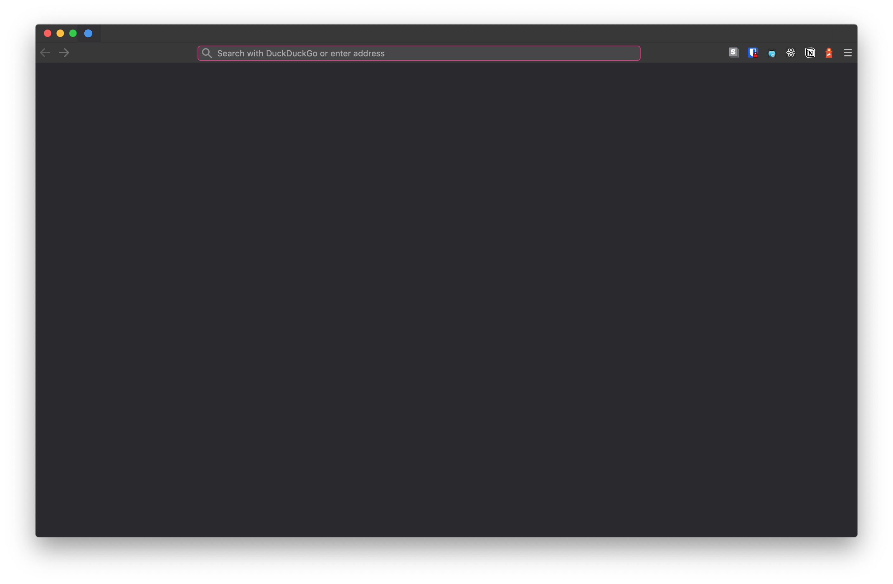
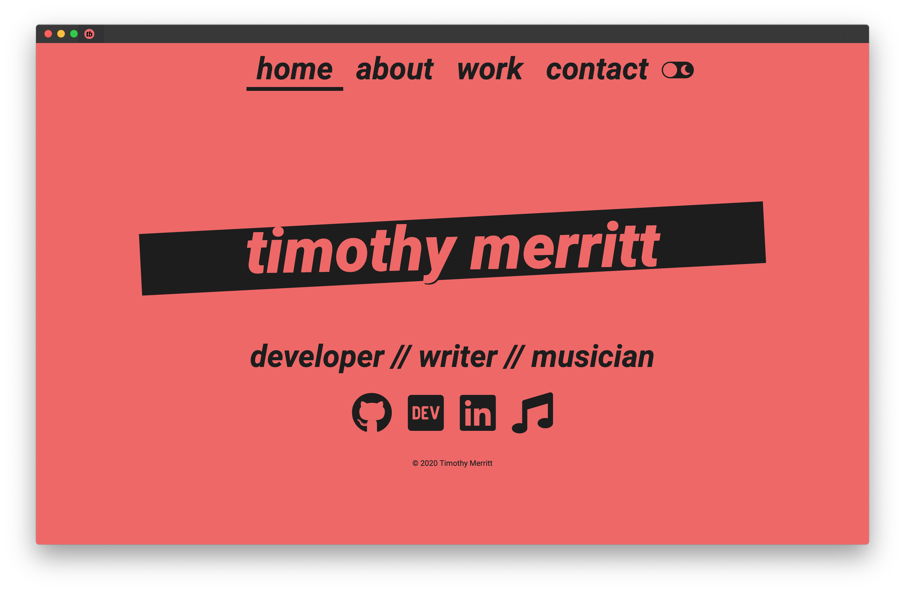

# Firefox

This is my custom barebones Firefox configuration. I prefer a minimal, compact aesthetic to stay out of the way, and use custom colors to unify much of the browser's look.

Accessing the address/search bar requires using the keyboard shortcut `⌘ + l` (`ctrl + l` on Windows).

## Custom new tab default favicon

## A blank new window

## The address bar made visible with ⌘ + l

## The dropdown search results and highlighting colors

## timmybytes.com with the address bar collapsed

