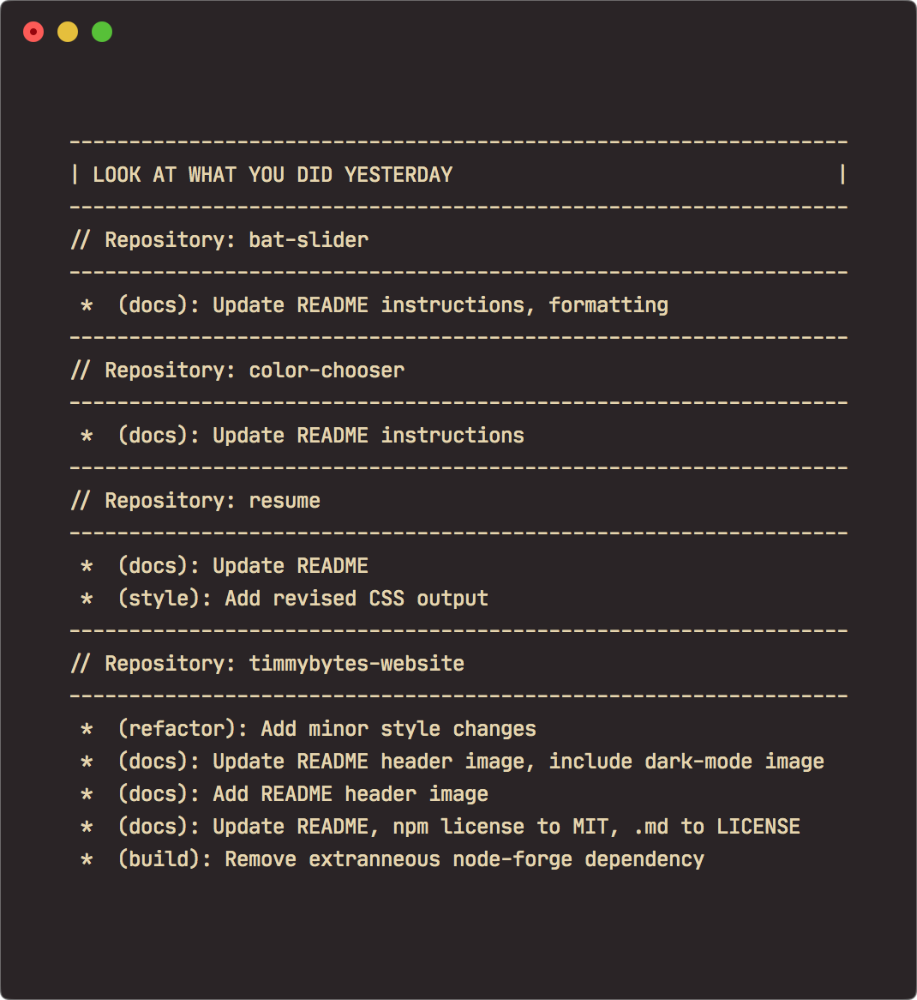

# OMDWDYD



**OMGWDYD** (Oh My God, What Did You Do?!) is a tool to help track my productivity. Currently, it loops through my main projects folder, checks any git repos inside for commits made since the previous day, and prints them all to stdout in a concise format.

I'm still adding features and testing edge cases, but feel free to use it its helpful.

Just download the [`what_you_did.sh`](./what_you_did.sh) file.

Change the `for dir in ~/Projects/\#Repos/*` in the `what_you_did.sh` file to whatever parent directory of repositories you want to check.

Then from a Mac/Linux terminal, run the following to make the script executable:

```sh
chmod +x what_you_did.sh
```

Then to run the script, just type:

```sh
./what_you_did.sh
```

## Features - To Do!

- [x] Get previous day's git commits from all repos
- [ ] Pair with gitcheck for repo health check
- [ ] Get previous day's tweet containing “#100DaysOfCode”
- [ ] Get Wakatime stats from previous day
- [x] Display stats concisely in terminal
- [ ] Automate script to run each morning
- [ ] Output to PDF/HTML and email results?
