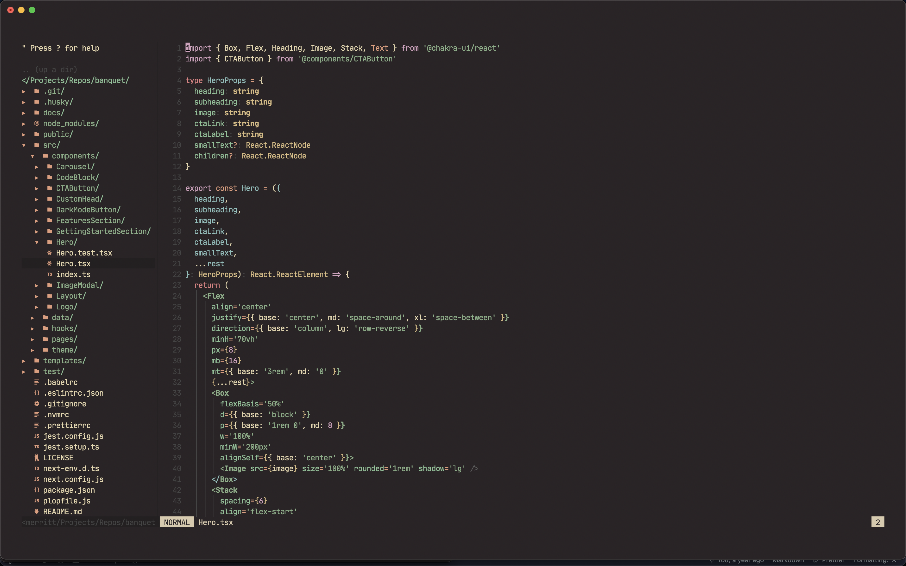
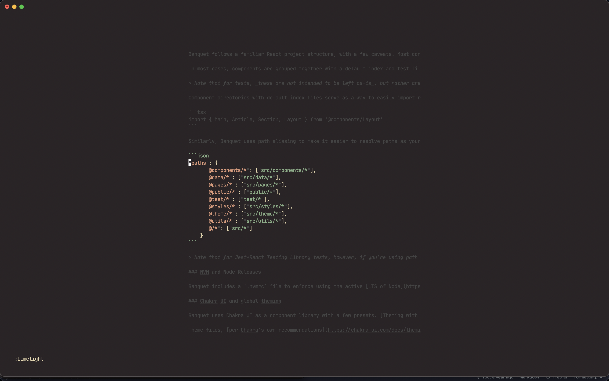

# NEOVIM README

My current neovim setup. I use [Vim Plug](https://github.com/junegunn/vim-plug) as a plugin manager, [Miramare](https://github.com/franbach/miramare) for colorscheme, and various other plugins for formatting, highliting, etc. I'm in the process of rewriting my `init.vim`, so take these settings as a work in progress.

## Configuration

`~/.config/nvim/init.vim`

`~/.local/share/nvim/site/autoload/plug.vim`

## Screenshots

<figure>
  
  <figcaption align='center'>Neovim with Miramare color scheme and NERDTree.</figcaption>
</figure>

<figure>
  
  <figcaption align='center'>Neovim with Goyo and Limelight enabled.</figcaption>
</figure>
