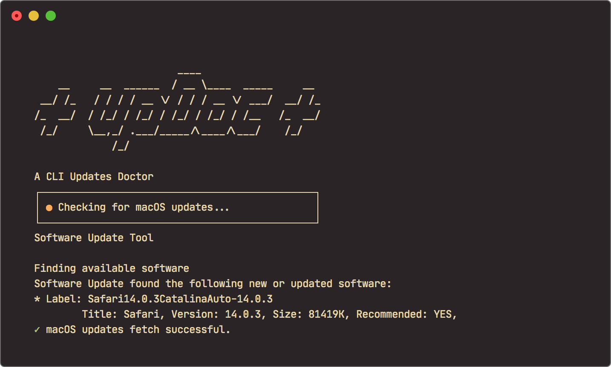
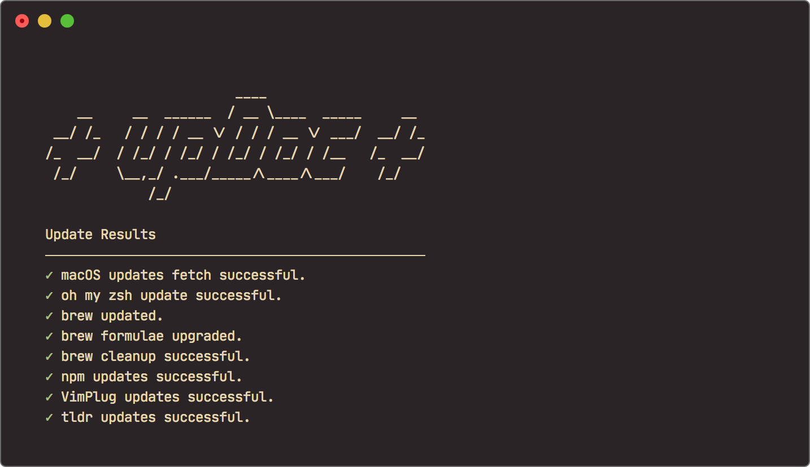
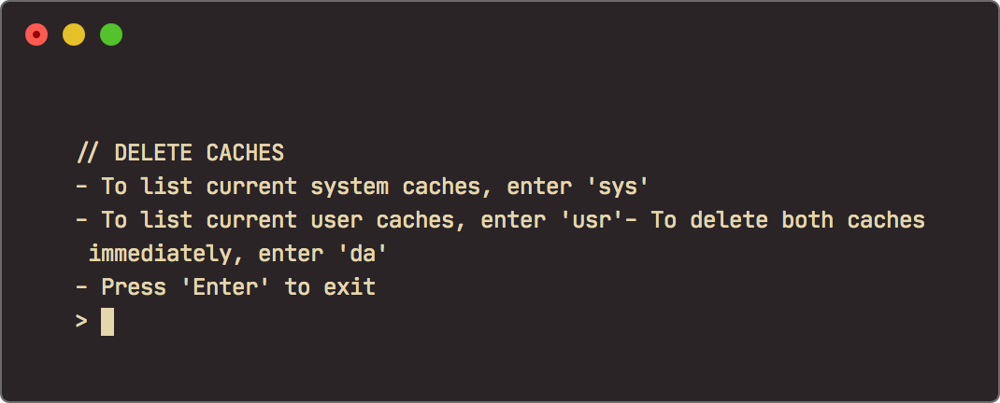
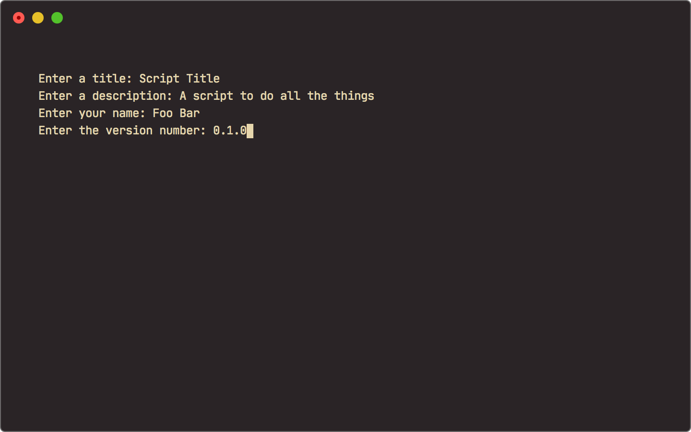
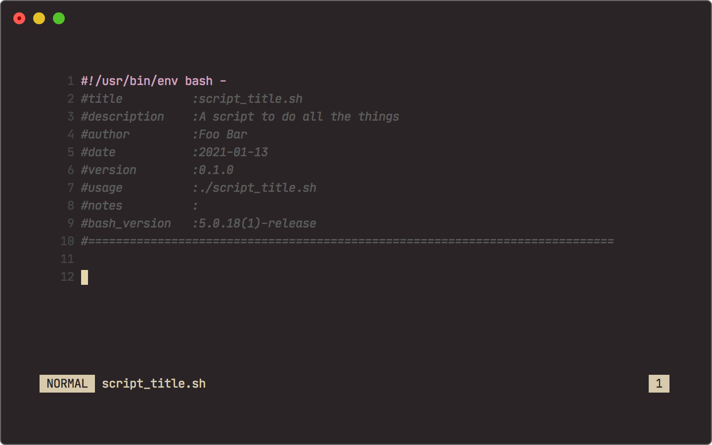

# Scripts

These are some of the scripts I use in development, mostly written in Bash or Python.

* [OMGWDYD](#omgwdyd) - git commits from the last 24 hours
* [Clear Caches](#clear-caches) - Clear user and system caches
* [Bash Header Generator](#bash-header-generator) - Create header information for new bash scripts

---

## upDoc

  <strong>A CLI updates doctor</strong>

[**upDoc**](./updoc.sh) is a simple script to update a variety of my configs at the same time. It's still an early version that needs to be slimmed down and better adapted for scaling, but it works by running a series of updates, recording the results (pass/fail) for each process in a temporary file, and displaying final results. Eventually this will be run as a cron/launchd job to fully automate the process.

## OMGWDYD (Currently non-operational)

<h2 align="center">

</h2>

  <strong>A CLI tool to motivate (or shame) you</strong>

  

**OMGWDYD (Oh My God, What Did You Do?!)** is a Bash script that displays your git commits from the last 24 hours. It's a simple tool to keep track of what you've been working on and motivate you to keep it up (or shame you by showing your lack of ambition...). You can learn more about it [here](https://github.com/timmybytes/OMGWDYD).

## Clear Caches

This is a simple script written in Bash to clear out user and system caches through the CLI. See the script [here](clear_caches.sh).

## Bash Header Generator

This is a bash script for writing bash scripts. Upon execution it creates an interactive prompt to generate meta information for a bash script header. [Original source here](https://code.activestate.com/recipes/577862-bash-script-to-create-a-header-for-bash-scripts/). See the script [here](make_header.sh).

